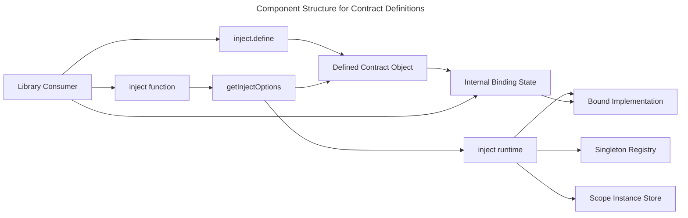
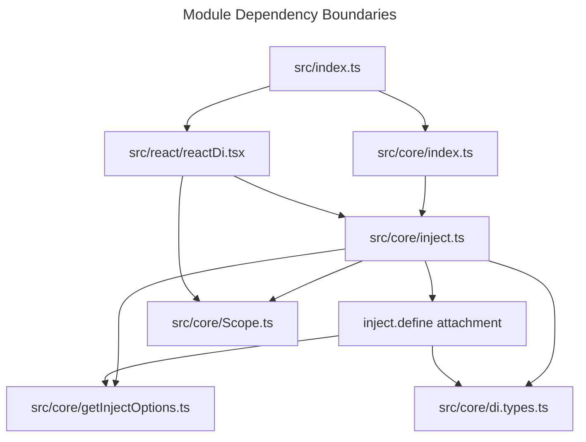
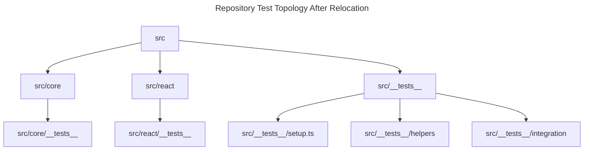

## Overview

This design adds contract definitions through `inject.define<T>(name)` without introducing new named package exports. The returned contract object becomes the single public artifact for environment-specific binding, direct `inject()` consumption, optional `inject.provide()` usage, and cache identity. This keeps the package surface centered on `inject` while reusing the repository's existing object-shaped injection path and constructor-based runtime behavior where possible [ref: ../01-research/04-open-questions.md#user-answers] [ref: ../01-research/01-core-contract-analysis.md#current-contract-surface-already-has-an-object-based-injection-path] [ref: ../01-research/01-core-contract-analysis.md#package-level-exposure-is-currently-top-level-only].

The runtime change is not zero. The design explicitly broadens three internal seams: type normalization must recognize a defined contract as a first-class inject target, scoped storage must accept object-backed tokens instead of constructor-only typings, and bound contracts must expose scoped bindings as already-registered providers so `bind()` has usable semantics for environment-specific selection [ref: ../01-research/04-open-questions.md#user-answers] [ref: ../01-research/01-core-contract-analysis.md#the-repository-still-models-several-core-seams-around-constructors] [ref: ../01-research/01-core-contract-analysis.md#future-contract-definition-behavior-would-be-constrained-by-existing-scope-provide-and-lifecycle-semantics].

## Architecture Drivers

- Keep the public API centered on `inject.define` and avoid widening the package surface beyond what the task and user answers justify [ref: ../01-research/04-open-questions.md#q1-what-is-the-intended-public-api-and-export-surface-for-contract-definitions] [ref: ../01-research/04-open-questions.md#user-answers].
- Make the returned contract object directly consumable by `inject()` and internally self-sufficient for binding state [ref: ../01-research/04-open-questions.md#q3-how-should-binding-semantics-work-for-environment-specific-implementation-selection] [ref: ../01-research/04-open-questions.md#q4-what-type-shape-must-injectdefinetname-return-so-that-it-fits-the-current-inject-and-provide-contracts].
- Preserve constructor-based injection as an unchanged path for existing consumers [ref: ../01-research/01-core-contract-analysis.md#decorator-metadata-path] [ref: ../01-research/01-core-contract-analysis.md#token-name-and-constructor-derivation].
- Respect the user preference for minimal runtime change, but document every required broadening where constructor-only seams would otherwise block contract objects [ref: ../01-research/04-open-questions.md#q5-is-the-task-assumption-that-inject-needs-no-changes-beyond-adding-define-actually-compatible-with-current-scope-and-storage-internals] [ref: ../01-research/04-open-questions.md#user-answers].
- Move source-adjacent tests into per-module `__tests__` folders while keeping existing suffix-based discovery intact and shared setup/integration assets in place [ref: ../01-research/04-open-questions.md#q7-what-target-test-topology-is-actually-intended-by-move-tests-into-__tests__-directories] [ref: ../01-research/04-open-questions.md#q9-which-test-discovery-and-compilation-assumptions-are-allowed-to-change-as-part-of-the-relocation] [ref: ../01-research/02-test-topology-analysis.md#vitest-discovery-and-setup-behavior].

## System Fit

The feature fits inside the existing root package structure. `inject` remains the single top-level DI entry point, and the new contract-definition behavior is added under the existing core export path that is already re-exported from the package root [ref: ../01-research/01-core-contract-analysis.md#export-surface-and-package-entry-points]. React integration does not get a new API; it benefits indirectly because `DiScopeProvider` already accepts `provide` inputs and because the same `inject()` runtime is shared by React and non-React consumers [ref: ../01-research/02-test-topology-analysis.md#react-adjacent-source-and-documentation-covered-by-moved-tests].

## Module Boundaries

### 1. Public API Boundary

`inject.define<T>(name)` is attached to the existing `inject` export. No separate `defineContract`, token class, or new package subpath is introduced. The returned object is the public handle for the contract, but the documented public API remains the method pair `inject.define(...).bind(...)` plus direct use in `inject(contract)` [ref: ../01-research/04-open-questions.md#user-answers] [ref: ../01-research/01-core-contract-analysis.md#package-level-exposure-is-currently-top-level-only].

### 2. Contract Object Boundary

The defined contract object is both:

- the runtime identity for caching and scoped lookup;
- the mutable holder of binding state;
- the structural input that `getInjectOptions()` can normalize into computed injection options.

This follows the existing object-shaped injection path instead of adding a parallel registration container [ref: ../01-research/01-core-contract-analysis.md#current-contract-surface-already-has-an-object-based-injection-path] [ref: ../01-research/03-external-patterns.md#established-practices].

### 3. Binding Boundary

`bind()` accepts the same kinds of provider inputs the runtime already knows how to normalize today: constructor-backed providers and object-shaped inject options. The binding is stored as normalized provider state on the contract object, but resolution remains lazy. No instance is created during binding [ref: ../01-research/04-open-questions.md#q3-how-should-binding-semantics-work-for-environment-specific-implementation-selection] [ref: ../01-research/01-core-contract-analysis.md#provide-contract-and-requireprovide-semantics].

### 4. Runtime Resolver Boundary

`inject()` keeps responsibility for lifetime branching, cache semantics, parent-scope compatibility, circular-dependency detection, and scope lifecycle hooks. The contract feature does not reimplement resolution logic; it feeds the existing resolver a new object-backed token and a bound implementation factory [ref: ../01-research/01-core-contract-analysis.md#lifetime-resolution-and-caching-rules] [ref: ../01-research/01-core-contract-analysis.md#scope-lifecycle-and-error-paths].

### 5. Repository Topology Boundary

The relocation introduces two new per-module test roots:

- `src/core/__tests__`
- `src/react/__tests__`

The existing shared assets remain centralized:

- `src/__tests__/setup.ts`
- `src/__tests__/helpers/*`
- `src/__tests__/integration/*`

This keeps module-local unit tests close to their domain folders while preserving the already-established shared setup and integration tree [ref: ../01-research/02-test-topology-analysis.md#current-test-layout] [ref: ../01-research/04-open-questions.md#user-answers].

## Contract-Definition Architecture

### Contract Identity

Each `inject.define<T>(name)` call creates one unique contract object. That object instance is the runtime token used by the singleton registry and the scoped instance store. The string name is diagnostic metadata only and is not part of identity. This mirrors the research-backed object-identity pattern from Angular while avoiding string collisions and avoiding a symbol-based storage redesign for scoped tokens [ref: ../01-research/04-open-questions.md#q2-what-runtime-identity-should-a-defined-contract-use] [ref: ../01-research/03-external-patterns.md#established-practices] [ref: ../01-research/03-external-patterns.md#pitfalls].

### Contract Participation in `inject()`

The contract object participates in `inject()` through the existing object-input normalization path. Architecturally, the object exposes the fields needed by normalization through getters backed by internal state:

- `token` returns the contract object itself;
- `name` returns the define-time name;
- `lifetime` mirrors the currently bound implementation;
- `getInstance` delegates to the bound implementation factory;
- `requireProvide` is `false` once a binding exists, because binding is the provider-registration step for the contract.

If no binding exists, contract normalization fails before lifetime dispatch with an unbound-contract runtime error. This is a new error path but does not require a new public export [ref: ../01-research/04-open-questions.md#q4-what-type-shape-must-injectdefinetname-return-so-that-it-fits-the-current-inject-and-provide-contracts] [ref: ../01-research/04-open-questions.md#q5-is-the-task-assumption-that-inject-needs-no-changes-beyond-adding-define-actually-compatible-with-current-scope-and-storage-internals] [ref: ../01-research/01-core-contract-analysis.md#token-name-and-constructor-derivation].

### Binding Storage

`bind()` writes a normalized provider descriptor into internal state on the contract object. The stored descriptor contains the bound implementation's factory and lifetime metadata, but token identity is rewritten to stay on the contract object. That split is critical:

- implementation metadata controls how an instance is created and which lifetime semantics apply;
- contract identity controls where caches and scope entries are stored.

This gives environment-specific contract selection without changing constructor-based classes or creating duplicate caches for the same contract [ref: ../01-research/04-open-questions.md#user-answers] [ref: ../01-research/01-core-contract-analysis.md#lifetime-resolution-and-caching-rules].

### Constructor Compatibility

Constructor-based injection remains unchanged:

- `inject(SomeClass)` still uses constructor metadata;
- constructor tokens remain valid cache keys;
- decorated lifetimes and scope callbacks are still derived from constructor metadata;
- codebases that do not use `inject.define` do not change behavior.

The new contract path is additive and routes through the same normalization and resolution infrastructure [ref: ../01-research/01-core-contract-analysis.md#decorator-metadata-path] [ref: ../01-research/01-core-contract-analysis.md#token-name-and-constructor-derivation].

## Runtime Touchpoints and Required Broadening

| Area | Required architectural change | Why it is required |
|---|---|---|
| `src/core/di.types.ts` | Introduce a defined-contract-compatible inject target type alongside constructor inputs | Current public generic seams are constructor-oriented and do not describe a contract object that can be passed directly to `inject()` [ref: ../01-research/01-core-contract-analysis.md#public-contract-types] [ref: ../01-research/01-core-contract-analysis.md#the-repository-still-models-several-core-seams-around-constructors] |
| `src/core/getInjectOptions.ts` | Normalize defined contracts as object-backed inject inputs and validate bound state | Contract objects must become direct `inject()` arguments without inventing a second resolution pipeline [ref: ../01-research/04-open-questions.md#user-answers] [ref: ../01-research/01-core-contract-analysis.md#current-contract-surface-already-has-an-object-based-injection-path] |
| `src/core/inject.ts` | Attach `define` to `inject`, preserve cache/lifecycle logic, and treat bound contracts as already provided | Binding must be useful for environment-specific selection, including scoped bindings, while reusing existing lifetime branching [ref: ../01-research/04-open-questions.md#q3-how-should-binding-semantics-work-for-environment-specific-implementation-selection] [ref: ../01-research/01-core-contract-analysis.md#future-contract-definition-behavior-would-be-constrained-by-existing-scope-provide-and-lifecycle-semantics] |
| `src/core/Scope.ts` | Broaden scoped storage typing from constructor-only to object-backed tokens | The selected token identity is the contract object instance, and constructor-only typings are the known constructor-oriented seam in current code [ref: ../01-research/04-open-questions.md#q2-what-runtime-identity-should-a-defined-contract-use] [ref: ../01-research/01-core-contract-analysis.md#the-repository-still-models-several-core-seams-around-constructors] |
| `src/react/reactDi.tsx` | No new API, but `provide` inputs become contract-compatible through widened DI types | React scope provisioning already routes through core provide semantics and should not diverge from core DI behavior [ref: ../01-research/02-test-topology-analysis.md#react-adjacent-source-and-documentation-covered-by-moved-tests] |

## Scoped, Singleton, and Transient Semantics

### Singleton

A bound singleton contract caches exactly one instance per contract object in the existing singleton registry. Rebinding after first resolution is forbidden, so the registry never has to reconcile two implementations for the same contract token [ref: ../01-research/04-open-questions.md#user-answers] [ref: ../01-research/01-core-contract-analysis.md#lifetime-resolution-and-caching-rules].

### Scoped

A bound scoped contract requires an active scope, still participates in parent-scope compatibility checks, still uses the `INJECTING_INSTANCE` sentinel for circular detection, and still uses `onScopeInit` and cleanup semantics from the bound implementation. The only deliberate change is that a binding counts as registration, so `requireProvide` is considered satisfied for the contract path [ref: ../01-research/01-core-contract-analysis.md#scope-lifecycle-and-error-paths] [ref: ../01-research/01-core-contract-analysis.md#provide-contract-and-requireprovide-semantics].

### Transient

Transient contracts create a fresh instance on each resolution through the bound implementation factory. Rebinding is still frozen after first resolution to keep contract semantics stable across all lifetimes [ref: ../01-research/04-open-questions.md#user-answers] [ref: ../01-research/01-core-contract-analysis.md#lifetime-resolution-and-caching-rules].

## Test-Topology Organization

### Target Structure

The repository adopts a split test topology:

- domain-local unit tests move under `src/core/__tests__` and `src/react/__tests__`;
- shared setup/helpers/integration remain under `src/__tests__`.

This matches the user's chosen topology while preserving the existing role of the shared `src/__tests__` tree [ref: ../01-research/04-open-questions.md#user-answers] [ref: ../01-research/02-test-topology-analysis.md#current-test-layout].

### React Hook Import Strategy

Relocated React hook tests switch to alias-based imports instead of trying to preserve same-folder adjacency. That aligns them with the rest of the repository's test pattern and decouples the test folder design from source-relative path assumptions [ref: ../01-research/02-test-topology-analysis.md#file-by-file-inventory-for-moved-test-candidates] [ref: ../01-research/04-open-questions.md#q8-how-should-the-two-react-hook-tests-that-rely-on-same-directory-relative-imports-behave-after-relocation].

### Discovery and Config Boundary

No Vitest or TypeScript discovery changes are required for the chosen topology because the existing include rules are already suffix-based and recursive under `src/**`, and the shared setup file remains at its current path. Configuration changes are therefore explicitly out of scope unless implementation later changes naming or relocates `src/__tests__/setup.ts` [ref: ../01-research/02-test-topology-analysis.md#vitest-discovery-and-setup-behavior] [ref: ../01-research/03-external-patterns.md#test-organization-patterns].

## Architectural Invariants

1. The contract object instance is the only runtime identity for a defined contract.
2. The contract cannot be rebound after the first successful or attempted instance-creation path invokes its bound `getInstance`.
3. Binding changes provider metadata, not cache ownership.
4. Constructor-based injection remains a fully supported and behaviorally unchanged path.
5. Test relocation does not change filename suffixes, setup-file location, or the role of the shared integration tree.
