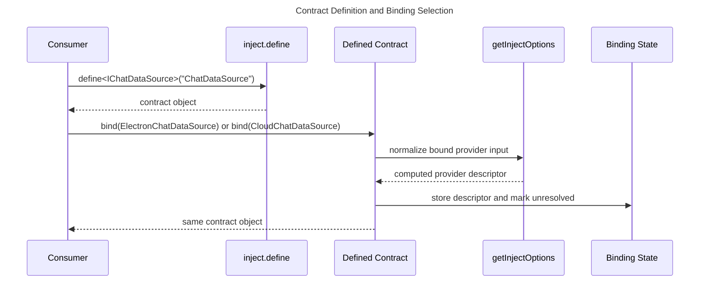
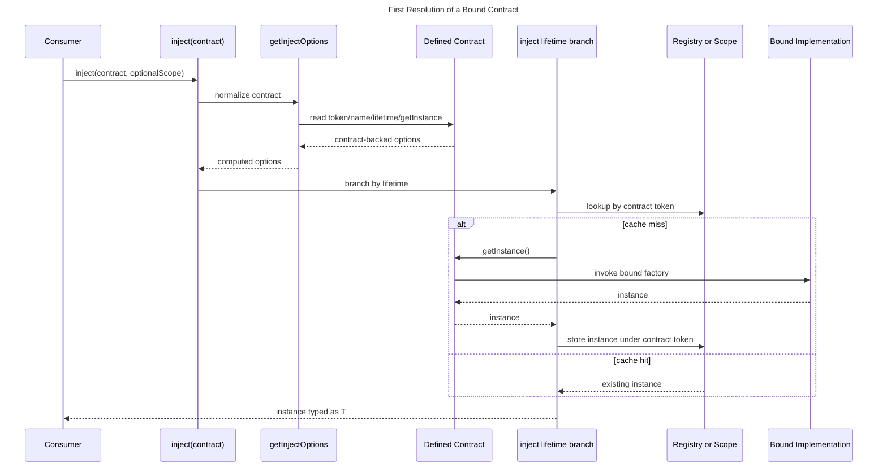
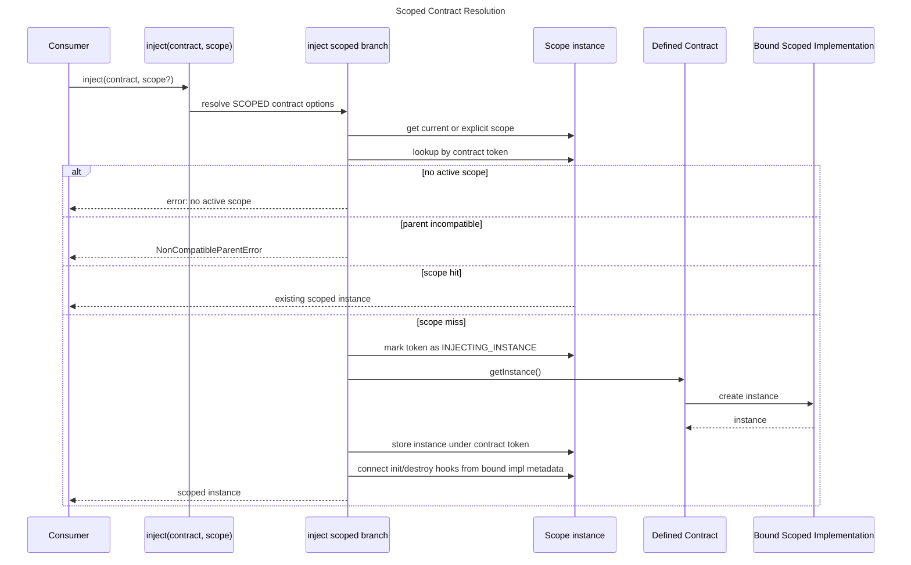
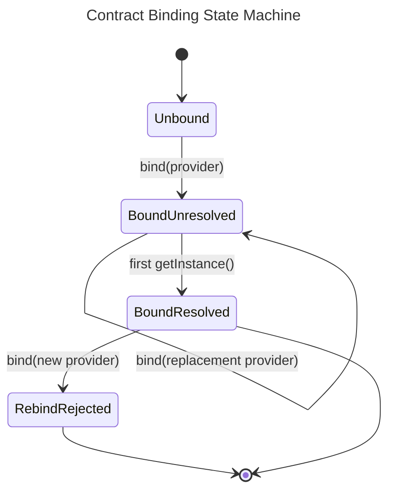

## Overview

The new data flow keeps binding-time work lightweight and pushes all lifetime-sensitive behavior into the existing resolver. `define()` creates a stable contract object, `bind()` selects the implementation by writing normalized provider metadata into contract state, and `inject(contract)` later resolves through the same singleton/scoped/transient branches already used for constructors [ref: ../01-research/01-core-contract-analysis.md#lifetime-resolution-and-caching-rules] [ref: ../01-research/04-open-questions.md#user-answers].

## Flow 1: Contract Definition and Environment-Specific Binding Selection

This flow covers bootstrapping-time contract creation and environment branching.



Key properties of this flow:

- identity is fixed at define time by the returned contract object, not by the chosen implementation name [ref: ../01-research/04-open-questions.md#q2-what-runtime-identity-should-a-defined-contract-use] [ref: ../01-research/03-external-patterns.md#pitfalls];
- binding is lazy and writes metadata only, so bootstrapping does not instantiate dependencies early [ref: ../01-research/04-open-questions.md#q3-how-should-binding-semantics-work-for-environment-specific-implementation-selection];
- the provider descriptor is normalized once at bind time so later resolutions can reuse existing runtime semantics without a second conversion path [ref: ../01-research/01-core-contract-analysis.md#current-contract-surface-already-has-an-object-based-injection-path].

## Flow 2: First Resolution of a Bound Contract

This is the main runtime path for `inject(contract)` after binding.



Important consequences:

- the cache key is the contract token, so environment selection changes implementation identity without changing consumer call sites [ref: ../01-research/04-open-questions.md#user-answers];
- scoped and singleton caches remain independent from constructor tokens, preventing accidental sharing between `inject(SomeClass)` and `inject(SomeContract)` [ref: ../01-research/01-core-contract-analysis.md#lifetime-resolution-and-caching-rules];
- the contract is marked resolved when `getInstance()` is first invoked, which freezes rebinding from that point onward [ref: ../01-research/04-open-questions.md#q6-what-should-happen-when-the-same-contract-is-bound-more-than-once-or-after-it-has-already-been-resolved] [ref: ../01-research/04-open-questions.md#user-answers].

## Flow 3: Bound Scoped Contract Resolution

The scoped flow keeps current scope restrictions and lifecycle semantics, but binding counts as provider registration.



The deliberate behavioral rule is that `bind()` satisfies the registration requirement for the contract path. `inject.provide(contract, scope)` remains valid as an eager-instantiation path, but it is no longer mandatory for a bound scoped contract [ref: ../01-research/01-core-contract-analysis.md#provide-contract-and-requireprovide-semantics] [ref: ../01-research/01-core-contract-analysis.md#scope-lifecycle-and-error-paths] [ref: ../01-research/04-open-questions.md#user-answers].

## Flow 4: Rebinding Before First Resolution

Rebinding is allowed only while the contract has not yet created any instance.



Operational interpretation:

- `bind()` may replace the descriptor while the contract is still unresolved;
- once resolution begins, rebinding is rejected to avoid cache ambiguity for singleton and scoped lifetimes [ref: ../01-research/04-open-questions.md#q6-what-should-happen-when-the-same-contract-is-bound-more-than-once-or-after-it-has-already-been-resolved] [ref: ../01-research/01-core-contract-analysis.md#lifetime-resolution-and-caching-rules];
- no cache invalidation flow is needed because rebinding never happens after cache ownership may have been established [ref: ../01-research/03-external-patterns.md#pitfalls].

## Flow 5: Unbound Contract Failure

An unbound contract fails during normalization rather than deep inside lifetime branching.

1. Consumer calls `inject(contract)`.
2. `getInjectOptions()` recognizes the object as a defined contract.
3. The contract state has no bound descriptor.
4. Normalization throws an unbound-contract error using the define-time name.

This keeps the failure local to the contract-definition layer and avoids partially entering singleton or scoped bookkeeping with missing binding metadata [ref: ../01-research/04-open-questions.md#q3-how-should-binding-semantics-work-for-environment-specific-implementation-selection] [ref: ../01-research/04-open-questions.md#q4-what-type-shape-must-injectdefinetname-return-so-that-it-fits-the-current-inject-and-provide-contracts].

## Flow 6: Test Discovery and Execution After Relocation

The chosen topology does not require discovery-rule changes because file suffixes remain unchanged.

```mermaid
---
title: Test Discovery After Relocation
---
flowchart TD
    Vitest[Vitest include globs]
    Tsconfig[tsconfig.test.json include]
    CoreTests[src/core/__tests__/*.test.ts]
    ReactTests[src/react/__tests__/*.test.tsx]
    SharedSetup[src/__tests__/setup.ts]
    Alias[@ alias resolution]
    Run[Test execution]

    Vitest --> CoreTests
    Vitest --> ReactTests
    Tsconfig --> CoreTests
    Tsconfig --> ReactTests
    SharedSetup --> Run
    Alias --> Run
    CoreTests --> Run
    ReactTests --> Run
```

This flow relies on three preserved invariants:

- test files keep `.test.ts` or `.test.tsx` suffixes, which the current shared Vitest config already includes [ref: ../01-research/02-test-topology-analysis.md#vitest-discovery-and-setup-behavior] [ref: ../01-research/03-external-patterns.md#established-practices];
- `src/__tests__/setup.ts` remains at the configured path, so `setupFiles` does not need to change [ref: ../01-research/02-test-topology-analysis.md#vitest-discovery-and-setup-behavior];
- relocated hook tests switch to alias imports, so moving into `src/react/__tests__` no longer depends on same-folder relative imports [ref: ../01-research/02-test-topology-analysis.md#file-by-file-inventory-for-moved-test-candidates] [ref: ../01-research/04-open-questions.md#q8-how-should-the-two-react-hook-tests-that-rely-on-same-directory-relative-imports-behave-after-relocation].

## Data-Flow Invariants

1. `define()` fixes identity but not implementation.
2. `bind()` fixes implementation metadata but does not allocate an instance.
3. `inject(contract)` always caches by contract token, never by implementation constructor.
4. Bound scoped contracts still require scope presence and scope compatibility.
5. Test relocation is structural only; discovery continues through existing suffix-based rules.
