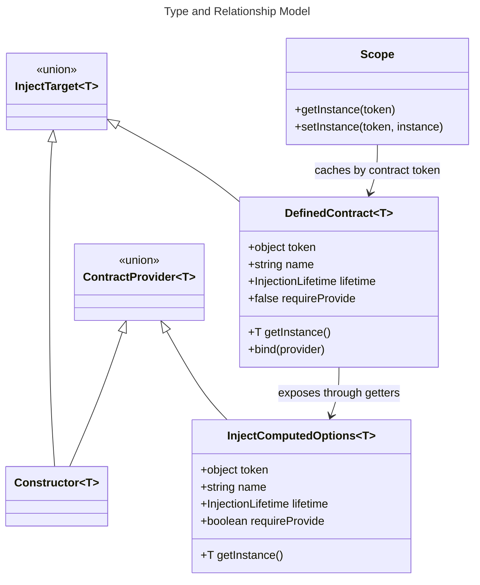

## Overview

The model introduces one new domain concept, the defined contract object, and keeps all existing runtime semantics anchored in the current DI model of normalized inject options, lifetimes, caches, and scopes. The design avoids introducing a standalone container or a second provider graph [ref: ../01-research/01-core-contract-analysis.md#current-contract-surface-already-has-an-object-based-injection-path] [ref: ../01-research/03-external-patterns.md#established-practices].

## Core Entities

### Defined Contract

A defined contract is the runtime representation of an interface-like dependency contract. It has three roles:

1. stable token identity;
2. mutable binding state holder;
3. structural `inject()` input.

The contract object is created only by `inject.define<T>(name)` and is passed directly to `inject()` after binding [ref: ../01-research/04-open-questions.md#user-answers] [ref: ../01-research/04-open-questions.md#q4-what-type-shape-must-injectdefinetname-return-so-that-it-fits-the-current-inject-and-provide-contracts].

### Bound Provider Descriptor

The contract stores one normalized provider descriptor derived from the bound constructor or inject-options input. This descriptor carries:

- lifetime;
- implementation factory;
- scope lifecycle callbacks when present;
- diagnostic name of the implementation.

The descriptor does not own cache identity. Cache identity stays on the contract object [ref: ../01-research/01-core-contract-analysis.md#lifetime-resolution-and-caching-rules].

### Binding State

Binding state is the minimal mutable state required for rebinding rules and resolution safety:

- `unbound`
- `bound-unresolved`
- `bound-resolved`

This state exists per contract object and is independent from singleton registry entries or scope-local instances [ref: ../01-research/04-open-questions.md#q6-what-should-happen-when-the-same-contract-is-bound-more-than-once-or-after-it-has-already-been-resolved].

### Repository Topology Artifact

The feature also introduces two persistent repository-structure artifacts:

- `src/core/__tests__`
- `src/react/__tests__`

These are organizational domains for module-local tests, while `src/__tests__` remains the shared-support and integration domain [ref: ../01-research/02-test-topology-analysis.md#current-test-layout] [ref: ../01-research/04-open-questions.md#user-answers].

## Type Model

The following TypeScript snippets describe the intended design model, not implementation code.

```ts
type Constructor<T = unknown> = new (...args: any[]) => T;

type ContractProvider<T> = Constructor<T> | InjectOptions<Constructor<T>>;

interface DefinedContract<T> {
  readonly token: object;
  readonly name: string;
  readonly lifetime: InjectionLifetime;
  readonly requireProvide: false;
  readonly getInstance: () => T;
  bind(provider: ContractProvider<T>): DefinedContract<T>;
}
```

Design notes:

- `token` is the contract object itself and therefore object-identity-based [ref: ../01-research/04-open-questions.md#q2-what-runtime-identity-should-a-defined-contract-use];
- `requireProvide` is always `false` for a bound contract because binding is the registration step [ref: ../01-research/01-core-contract-analysis.md#provide-contract-and-requireprovide-semantics];
- the type is structural so `inject(contract)` can reuse the existing object-input path, but the package does not need a new named export for this interface [ref: ../01-research/04-open-questions.md#q1-what-is-the-intended-public-api-and-export-surface-for-contract-definitions] [ref: ../01-research/04-open-questions.md#user-answers].

## Internal State Model

```ts
type ContractResolutionState<T> =
  | { status: "unbound" }
  | {
      status: "bound-unresolved";
      descriptor: InjectComputedOptions<Constructor<T>>;
    }
  | {
      status: "bound-resolved";
      descriptor: InjectComputedOptions<Constructor<T>>;
      firstResolvedAt: "singleton" | "scoped" | "transient";
    };
```

Interpretation:

- `descriptor.token` is not reused as cache identity; contract resolution rewrites token ownership to the contract object [ref: ../01-research/01-core-contract-analysis.md#token-name-and-constructor-derivation];
- `firstResolvedAt` is runtime bookkeeping for rebinding enforcement, not a public capability [ref: ../01-research/04-open-questions.md#user-answers];
- no list of historical bindings is required because only the latest unresolved binding matters [ref: ../01-research/04-open-questions.md#q6-what-should-happen-when-the-same-contract-is-bound-more-than-once-or-after-it-has-already-been-resolved].

## Type Hierarchy and Relationships



## Runtime Token Model

### Identity Rule

The runtime token for a defined contract is the contract object instance returned by `define()`. The define-time name is metadata only. Repeated calls to `inject.define<T>("SameName")` intentionally produce different tokens and therefore different caches and bindings [ref: ../01-research/03-external-patterns.md#pitfalls] [ref: ../01-research/04-open-questions.md#q2-what-runtime-identity-should-a-defined-contract-use].

### Cache Rule

All caches key by the contract token, not by the currently bound implementation. This means:

- a singleton contract has one singleton per contract object;
- a scoped contract has one scoped instance per scope per contract object;
- rebinding before first resolution does not need cache cleanup;
- rebinding after first resolution is forbidden to avoid stale cache state [ref: ../01-research/01-core-contract-analysis.md#lifetime-resolution-and-caching-rules] [ref: ../01-research/04-open-questions.md#user-answers].

### Constructor Interop Rule

Binding a contract to a constructor does not make the constructor and the contract interchangeable cache keys. `inject(CloudChatDataSource)` and `inject(ChatDataSourceContract)` are distinct resolution roots even if the contract is currently bound to that constructor [ref: ../01-research/01-core-contract-analysis.md#token-name-and-constructor-derivation].

## Scope Compatibility Model

The contract model inherits the current scoped rules from the runtime:

- active scope is still required for scoped lifetime;
- parent injectable lifetime compatibility remains enforced;
- `onScopeInit` and cleanup still flow from the bound implementation metadata;
- the `INJECTING_INSTANCE` sentinel still guards against circular resolution.

The only adjusted rule is registration: a bound contract is already considered registered and therefore does not require a separate `provide` step before scoped resolution [ref: ../01-research/01-core-contract-analysis.md#scope-lifecycle-and-error-paths] [ref: ../01-research/01-core-contract-analysis.md#provide-contract-and-requireprovide-semantics].

## Repository Topology Model

### Target Layout

```text
src/
  core/
    __tests__/
      errors.test.ts
      getInjectOptions.test.ts
      getInjectorName.test.ts
      inject.test.ts
      injectable.test.ts
      Scope.test.ts
  react/
    __tests__/
      reactDi.test.tsx
      useConstant.test.ts
      useSafeMount.test.tsx
  __tests__/
    setup.ts
    helpers/
    integration/
```

### Topology Rules

1. Unit tests follow the module they validate.
2. Shared setup and helpers remain centralized.
3. Integration suites remain centralized because they cross core/react boundaries.
4. React hook tests use alias imports after relocation instead of source-adjacent relative imports.
5. Filename suffixes remain unchanged so discovery and compilation rules stay valid [ref: ../01-research/02-test-topology-analysis.md#scope-boundaries-and-observed-discovery-dependencies] [ref: ../01-research/03-external-patterns.md#pitfalls].

## Invariants

1. A contract cannot exist in a partially bound-but-typeless state during injection; normalization either succeeds with a descriptor or fails as unbound.
2. Binding state is global per contract object, while scoped instances are local per scope.
3. The contract object is the only legal rebinding unit.
4. Shared test infrastructure remains in `src/__tests__` even after unit-test relocation.
