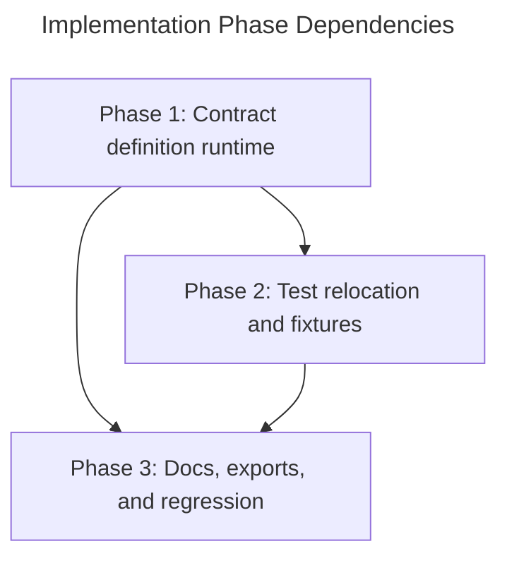

## Overview
This plan decomposes the approved design into three verified implementation phases: first the contract-definition runtime and type broadening around `inject.define`, then relocation of source-adjacent unit tests into module-local `__tests__` folders, and finally the export, integration-regression, and documentation pass. The plan keeps the approved design package authoritative, explicitly carries the `03-model.md` provider-typing inconsistency into Phase 1 reconciliation work, and limits documentation scope to the verified repository surfaces because no `apps/demos/` tree exists on disk.

## Phase Map

## Phase Summary

| Phase | Name | Type | Dependencies | Complexity | Files | Main Verification Gate |
|-------|------|------|--------------|------------|-------|------------------------|
| 1 | Contract definition runtime | Sequential | None | High | `src/core/di.types.ts`, `src/core/getInjectOptions.ts`, `src/core/inject.ts`, `src/core/Scope.ts`, existing core unit suites | `npm run ts-check` plus contract-runtime core tests |
| 2 | Test relocation and fixtures | Sequential | 1 | Medium | `src/core/__tests__/*`, `src/react/__tests__/*`, deletion of source-adjacent unit suites | `npm run ts-check` plus unchanged discovery of relocated suites |
| 3 | Docs, exports, and regression | Sequential | 1, 2 | Medium | `src/__tests__/integration/*`, `README.md`, `docs/concepts.md`, `docs/react-integration.md`, `docs/CHANGELOG.md` | `npm run ts-check` plus final integration/docs regression pass |

## Execution Rules
- No safe parallel execution is planned. Phase 2 relocates test files that Phase 1 must update for new runtime coverage, and Phase 3 verifies the final public surface only after runtime and topology work are complete.
- Every phase must leave the repository in a compilable state, with `npm run ts-check` passing before the next phase starts.
- Keep the package surface centered on the existing `inject` export. If implementation pressure suggests new named exports or a new subpath, that is a design mismatch and should be escalated rather than improvised.
- Keep `vitest.config.ts`, `tsconfig.test.json`, and the shared `src/__tests__/` infrastructure unchanged unless implementation uncovers a compile-blocking contradiction with ADR-7.
- Documentation work is limited to the verified existing surfaces `README.md`, `docs/concepts.md`, `docs/react-integration.md`, and `docs/CHANGELOG.md`.

## Quality Review

### Checklist
| # | Criterion | Status | Notes |
|---|-----------|--------|-------|
| 1 | Every design component mapped to task(s) | PASS | The redraft now maps the approved runtime-error semantics to concrete Phase 1 work through Task 1.5 on `src/core/errors.ts` plus `src/core/errors.test.ts`, while the rest of the design surface remains covered by Tasks 1.1-1.8, 2.1-2.3, and 3.1-3.4. This closes the prior gap without adding scope beyond the approved design package. |
| 2 | File paths concrete and verified | PASS | All repository-backed paths referenced by the plan were re-verified on disk: `src/core/*.ts`, source-adjacent unit suites under `src/core/` and `src/react/`, shared test infrastructure under `src/__tests__/`, `vitest.config.ts`, `tsconfig.test.json`, root `README.md`, and the targeted docs files under `docs/`. Planned create/delete paths under `src/core/__tests__/` and `src/react/__tests__/` remain concrete and consistent with the approved topology. |
| 3 | Phase dependencies correct | PASS | README graph and phase files agree on the dependency chain `Phase 1 -> Phase 2 -> Phase 3`, with Phase 3 also depending on Phase 1. No phase consumes work from a later phase and no circular dependency is present. |
| 4 | Verification criteria per phase | PASS | Each phase file contains an explicit Verification checklist, and each checklist includes phase-specific gates beyond generic completion text. |
| 5 | Each phase leaves project compilable | PASS | All three phases explicitly require `npm run ts-check` before proceeding, matching the minimum repository-compilable gate. |
| 6 | No vague tasks — exact files and changes | PASS | The prior ambiguity is resolved. Phase 1 now names the centralized DI error files directly, and Task 2.3 is correctly reframed as a verification-only boundary audit with `Action: Verify` instead of claiming a default file edit. Its fallback rule keeps any real incompatibility scoped to an explicit later edit against the exact affected file. |
| 7 | Design traceability (`[ref: ...]`) on all tasks | PASS | Every task in all three phase files carries direct design-section references, and the references align with the intended runtime, topology, test, docs, and risk sections. |
| 8 | Parallel/sequential correctly marked | PASS | The plan consistently marks execution as sequential and justifies why Phase 2 and Phase 3 cannot safely start before earlier dependencies settle. This matches the dependency graph and repository-memory rule against parallelizing dependent phases. |
| 9 | Complexity estimates present (L/M/H) | PASS | Every task includes a `Low`, `Medium`, or `High` estimate, and the phase summary also records overall phase complexity. |
| 10 | Documentation tasks proportional to existing docs/demos | PASS | The repository has a modest `docs/` surface and no `apps/` or `apps/demos/` tree on disk. The plan limits doc work to `README.md`, `docs/concepts.md`, `docs/react-integration.md`, and `docs/CHANGELOG.md`, which is proportionate to that footprint. |
| 11 | Mermaid dependency graph present | PASS | README includes a Mermaid dependency graph with all three phases and their dependencies. |
| 12 | Phase summary table complete | PASS | README includes a phase summary table with phase number, name, type, dependencies, complexity, files, and verification gate for each phase. |

### Documentation Proportionality
The documentation scope remains proportionate to the repository. The existing public docs surface is small and focused, and there is no `apps/demos/` area to justify example-heavy planning. The redraft does not expand documentation scope; it stays limited to one root README update, two focused guide updates, and one changelog entry across the verified `docs/` footprint.

### Issues Found
No issues found. The redraft resolves the previously recorded runtime-error mapping gap and the Task 2.3 file-boundary ambiguity, and it does so without introducing new implementation or documentation scope beyond the approved design.

## Next Steps
Proceed to implementation after human review of [01-contract-definition-runtime.md](./01-contract-definition-runtime.md), [02-test-relocation-and-fixtures.md](./02-test-relocation-and-fixtures.md), and [03-docs-exports-and-regression.md](./03-docs-exports-and-regression.md).